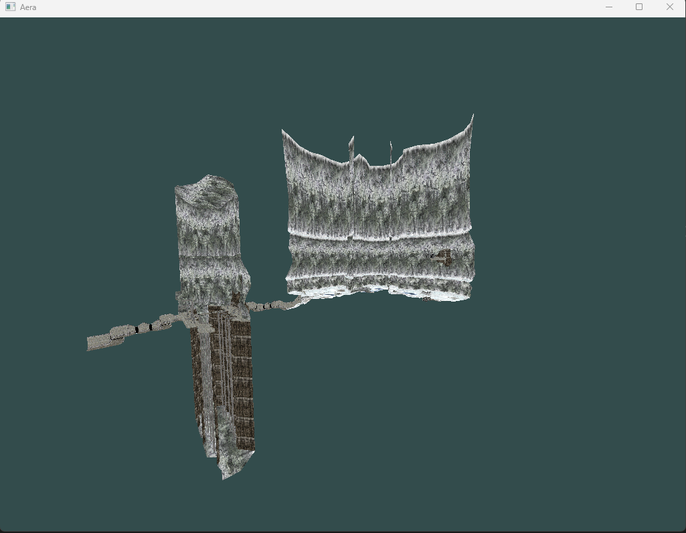

# aera - A Halo 1 Map Renderer

## How to build
1. Clone this repository and initialize submodules recursively
   ```bash
   git clone https://github.com/psychosphera/aera.git --recurse-submodules
   ```
   If you have already cloned the repo or just forgot to tack on the `--recurse-submodules`, you can initialize submodules with
   ```bash
   git submodule update --init --recursive
   ```
2. Create a build directory and `cd` into it
   ```bash
   mkdir build && cd build
   ```
   If you plan on doing multiple builds with different build options, just create different build directories for them
   ```bash
   mkdir build_gl
   mkdir build_d3d9
   <etc.>
   ```
4. Run CMake. Currently you'll only need to specify a render backend, but there will likely be more options (e.g. audio backend, input backend, etc.) later. OpenGL's the only one that really works right now. The current options are
   ```
   AERA_REMDER_BACKEND_GL
   AERA_REMDER_BACKEND_D3D9
   AERA_RENDER_BACKEND_D3D8
   ```
   Note that D3D8 will only work for 32-bit builds.
   ```bash
   cmake -DAERA_BACKEND_GL=TRUE ..
   ```
5. If you have any missing packages (SDL has quite a few dependencies, and you might not have all of them), install them with your system's package manager or vcpkg.
6. Build CMake's output. This will depend on your generator. On Linux/macOS/other Unix, `make` will probably be the default. Windows often defaults to `msbuild`. You can force a different choice by passing `-G` to CMake (e.g. `cmake -GNinja <...>`)
   `make` will only use 1 build job by default, you can speed it up with `make -j(nproc)`.
## How to build (Xbox)
1. Get your XDK up and running (hunting down the ISO isn't super hard, but it doesn't like installing on modern Windows, so you'll probably end up creating a Windows XP VM).
2. Open `projects/xbox/aera.vs2003/aera.vs2003.sln` with VS2003 and build.
Xbox implementation is still very much a work in progress, so while it will *build*, we're a good bit away from getting it debugged an on parity with the GL build.

## How to use
Since proper command line parsing hasn't been implemented yet, aera is hard-coded to use `c40.map`. You can either find the line `CL_LoadMap("c40.map")` in `cl_client.c` and change it to a different map, or just rename your map of choice to `c40.map`. Maps need to be in the `assets/maps` subdirectory.
Only *Xbox* maps will currently work, not Gearbox (the original PC port) or MCC maps.

If you did everything right, you'll end up being greeted with 


## FAQ
Q. Is support for PC/MCC maps coming?

A. Yes, eventually. PC maps won't be super difficult, MCC maps will probably require some effort.

Q. Are Vulkan/Metal/D3D11/D3D12/etc. render backends coming?

A. If someone wants to implement them, sure. At the very least, I'm going to iron out the D3D9 and D3D8 backends before attempting any new ones.

Q. Does the name mean anything?

A. No. I just thought it looked and sounded cool, and it's a homophone with a band I like (Erra).

Q. Can I use C++?

A. No.

Q. What C Standard does this project use?

A. The short version is: a subset of C99.

   The longer version: for gcc/clang, C99 is used. However, MSVC doesn't implement C99, it only implements C89 with extensions or C11 and later. So for MSVC, C11 is used. Maintaining compatibility between these two is basically just "don't use VLAs".
   
   However, complicating matters, the XDK compiler is VS2003, and it only has C89 support. *But*, MSVC has a command-line option to force C files to compile as C++ (`/TP`). The version of C++ that VS2003 uses is roughly compatible with C99, except no VLAs, no variadic macros, and no designated initializers.
  
   So to maintain compatibility across all three, the code has to be valid C99, valid C11 without optional features, *and* valid VS2003 C++. Some of this can be dealt with via preprocessor defs (`restrict`, `stdint.h` and `stdbool.h`, etc.), but some of it can't be worked around except by not using the missing features.
   
   TL;DR: C99 with no VLAs, no variadic macros, and no designated initializers.

Q. Why does the code look like idTech?

A. Because idTech 3 is the pinnacle of clean C code (/hj)

## Contributing
Contributions are very welcome. I haven't done a lot of documentation, so feel free to reach out with any questions.
  
